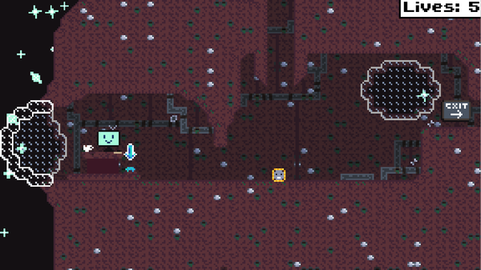

+++
title = "Image Resizing Oddness"
description = "How reducing an image's resolution can increase its file size + how to fix it using ImageMagick."
date = 2025-08-22
+++

# Image Resizing Oddness


## The Scenario
So, recently I was writing about a project I made a while ago on [the projects section](/projects) of my website. I decided to reduce the resolution of an image in order to improve site load times and I chose to do this using [ImageMagick](https://imagemagick.org/) with the following command:

```
$ magick image.webp -resize 600x600 image-RESIZED.webp
```

This command successfully resized the image from 1366x768 pixels to 600x337 pixels, so I used `ls` to check the file size:

```
$ ls -lh image*.webp

-rw-r--r-- 1 ollie users 187K Aug 21 20:22 image-RESIZED.webp
-rw-r--r-- 1 ollie users  13K Aug 21 20:18 image.webp
```

Hang on a minute! The resized image is over 14 times the size! Did I make a mistake and accidentally *increase* the resolution instead? Let's use ImageMagick to check.

```
$ magick identify image*.webp

image-RESIZED.webp WEBP 600x337 600x337+0+0 8-bit sRGB 190624B 0.000u 0:00.000
image.webp WEBP 1366x768 1366x768+0+0 8-bit sRGB 12710B 0.000u 0:00.000
```

There is no mistake. The one with the smaller resolution is definitely much much larger!

But why?...

## My Theory
After opening up the resized image in an image viewer, it was obvious that the pixel art had become extremely blurred. The image below shows this (you can right click, open image in new tab, and zoom in if the image is too small to see the blur).



Now, I am defiantly **not** and expert on image compression, but I do know that if there are multiple pixels of the same colour next to each other, then they can be compressed into one piece of information. e.g. instead of `blue, blue, blue, blue, blue` the image will just store `5 blue`. This is called [run-length encoding](https://en.wikipedia.org/wiki/Run-length_encoding).

Because the original image was pixel art, and each "pixel" in the pixel art is just a small square block of actual pixels, there is a very large number of pixels with the same colour next to each other. This provides many many opportunities for run-length encoding, reducing file size significantly.

In the resized image however, the newly introduced noise and blurriness brakes up these perfect blocks of solid colour, destroying the run-length encoding.

> [!IMPORTANT]
> I am not an image compression expert. This is just my best guess as to what's
> happening, I could be wrong.

## The Solution
So, if the blur is causing the image size to be larger, how do we remove the blur? Well my first thought was to disable anti-aliasing with the `+antialias` option, however this seemed to have no effect on image quality or file size. After that I tried all of the following options, also with no or limited effect: `-filter point`, `-interpolate integer`, `-interpolate nearest-neighbor`, `-filter box`, and `-scale 50%`.

Eventually, I tracked down [this comment on a GitHub issue](https://github.com/ImageMagick/ImageMagick/discussions/6788#discussioncomment-7282750) that suggested using the `-sample` option for cleaner resizing of pixel art.

```
$ magick image.webp -sample 600x600 image-SAMPLE.webp
```

This worked perfectly! The image quality is now lower and the image size reflects that by also being lower:

```
$ ls -lh image*.webp

-rw-r--r-- 1 ollie users  11K Aug 21 21:01 image-SAMPLE.webp
-rw-r--r-- 1 ollie users  13K Aug 21 20:18 image.webp
```

So a size reduction of only 2kB is not really worth the dramatic dip in quality, but at least we have successfully reduced its file size.

Here is the image resized using `-sample`. As before, if the image is too small to see the details, then you can right click, open image in new tab, and zoom in.


## What Does `-sample` Do Differently?
So why does `-sample 600x600` introduce less noise and blur than `-resize 600x600`?

Well here is an [excerpt from the ImageMagick docs](https://imagemagick.org/script/command-line-options.php?#sample) about the `-sample` option:

> When minifying, pixels are sub-sampled (i.e., some rows and columns are
> skipped over).

So basically, `-sample` uses a much simpler algorithm for shrinking images that just deletes rows/columns instead of doing some fancy filtering like `-resize`.

If you're curious, [this Stack Overflow comment](https://stackoverflow.com/a/13078621) provides an excellent breakdown of all the different ways to resize images with ImageMagick.

## Conclusion
The whole reason for doing this was to optimise my website's load times by reducing the size of a single large image (1366x768 pixels). However, the resized version was only actually 2kB smaller than original which was already only 13kB. Because of this negligible size difference and the enormous drop in quality, I did not end up using the minified image on my site.

I do not think this was a waste of time however, because I leaned some very useful things about ImageMagick that I think will be useful in the future.
