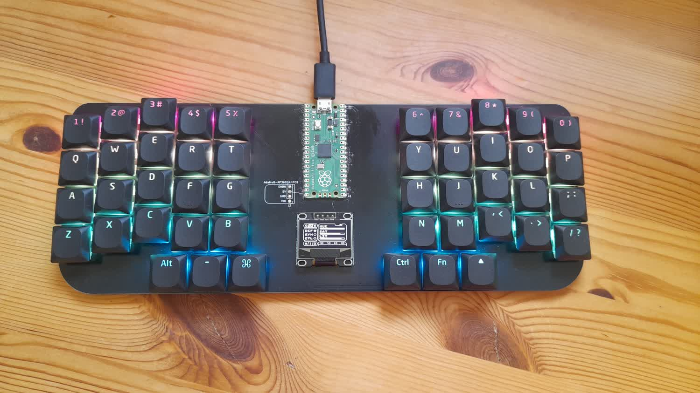
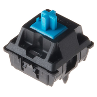
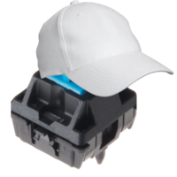
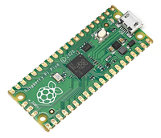

+++
title = "Building a Keyboard From Scratch"
description = "TODO: write a description"
date = 9999-01-01
draft = true
+++

# Building A Keyboard From Scratch


## Why?
So, why build your own keyboard?

Compete creative freedom! You want lights? You want a display? Both?! But maybe you don't. Maybe you don't like how flashy and distracting LEDs are, and instead want something sleek, stylish, and businesslike. The point is that you can *choose* and make exactly what you want.

Personally, I wanted my keyboard to have all the bells and whistles I could cram on to it including LEDs, an OLED screen, and a split design[^1]. In this post however, I will only go over the core knowledge needed in order to build a basic, no-frills keyboard and maybe go into detail about the extras in later posts.

## The Hardware

### What Is a Keyboard Matrix?
At the core of any keyboard is its key matrix. Understanding what a matrix is important when building your own keyboard because it you get it wrong, your keyboard will not work.

Imagine you have a just one button[^2] connected to a microcontroller[^3]. The microcontroller is connected to your computer via a USB cable. You press the button an the letter "a" appears on your screen. Simple enough, that's a single button keyboard. Now you just need to add the rest of the keys... all 104 of them.

```
        A
        |
###################
# Microcontroller #
###################
```

Doing this, you will quickly run into a problem: your microcontroller does not have 104 pins to connect to. The [Raspberry Pi Pico](https://www.raspberrypi.com/products/raspberry-pi-pico/) for example, only has 26 programmable GPIO pins. So what do you do?

```
   A  B  C  D  E  F  G
   |  |  |  |  |  |  |
T--###################--H
S--# Microcontroller #--I
R--###################--J
   |  |  |  |  |  |  |
   Q  P  O  N  M  L  K
```

Well this is where matrices come in. In a matrix, you only need one connection per row and column. For example, look at the following ASCI diagram of half a QWERTY keyboard:

```
+-----Q--W--E--R--T
|     |  |  |  |  |
| +---A--S--D--F--G
| |   |  |  |  |  |
| | +-Z--X--C--V--B
| | | |  |  |  |  |
| | | |  |  |  |  |
###################
# Microcontroller #
###################
```

As you can see, a matrix is basically just a grid of wires. Each row and column has its own wire that connects to the microcontroller. That means that although this keyboard has 15 keys, it only needs 8 connections to the microcontroller (3 for rows and 5 for columns).

You can already probably see how this solves our problem: on a standard keyboard layout with 104 keys if we use 6 rows and 18 columns then we will be able to connect every key to our microcontroller using only 24 connections.

I will not go into exactly *how* the microcontroller knows which key is pressed based of these rows and columns, but if you are curious then [this](https://docs.qmk.fm/how_a_matrix_works) explains it very well.

### Components
***TODO***

So here is a list of the basic components you will need:
- Key switches
- Key caps
- Diodes
- A Microcontroller

Lets break this list down into more detail:

#### Key Switches
There are many types of key switches to choose from, however the main types you will encounter that most brands provide some variation on are linear, tactile, and clicky.

Linear switches are generally smooth and quiet with little to no tackle feedback or click.

Tactile switches, as the name suggests, have a distinct tactile "bump" at approximately the point where the switch actuates.

Clicky switches are similar to tactile in that they also have a tactile bump. However, unlike tactile switches, clicky switches have some audible feedback as well.



#### Key Caps
Key caps are are little caps that sit on top of your key switches to make them nicer to press.



#### Diodes
***TODO*** 1N4148W

Diodes let current flow in only one direction. They are needed for this project for reasons that I will not go into here, but if you are curious then you can view [this section of the QMK docs](https://docs.qmk.fm/how_a_matrix_works).


#### Microcontroller
***TODO***



### Designing the PCB
***TODO***

### Assembly
***TODO***

## Software
So we have a keyboard, but it does not work... ***TODO: Maybe split this out into a separate article?***

## Cost
***TODO***

# TEMP
Stuff for my own reference, **remember to delete before releasing**.

Links:
- https://github.com/OllieSHunt/custom-keyboard-v2
- https://github.com/OllieSHunt/qmk_firmware
- https://docs.qmk.fm/how_a_matrix_works
- https://docs.qmk.fm/reference_glossary#matrix
  - "A wiring pattern of columns and rows that enables the MCU to detect keypresses with a fewer number of pins. The matrix often incorporates diodes to allow for NKRO."

***TODO: Am I really qualified to talk about this? I am struggling to write about this. Perhaps I should focus on the software instead?***


[^1]: Okay, technically my keyboard does not have *true* split design where the halves are separated by a cable, but I think that given how far apart the two halves are on the same circuit board, it still counts.

[^2]: Key switch = button. They are the same thing.

[^3]: A microcontroller can be thought of as a mini computer. It is the brain of every keyboard and turns you key presses into a signal that you PC will be able to understand.
