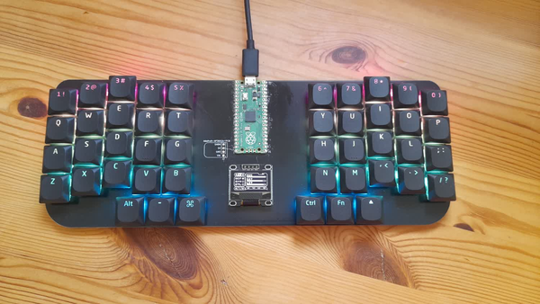

+++
title = "Custom Keyboard V2"
description = "The second version of my fully custom keyboard."
weight = 2

[extra]
source = "https://github.com/OllieSHunt/custom-keyboard-v2"
+++

# Custom Keyboard V2

Like the first version of this project, this keyboard is a semi split design and supports n-key rollover. Unlike the first design however, this keyboard has an RGB LED under every key as well as an OLED display.

## Hardware
The design process for this keyboard was very similar to the first one. I designed the PCB using [KiCad](https://www.kicad.org/) and then got it printed using [JLCPCB](https://jlcpcb.com/).

The LEDs are the `WS2812C-2020` model. These are daisy-chained together for easy control via QMK's inbuilt driver.

## Software
I used [QMK](https://qmk.fm/) to write this keyboard's firmware (just like in V1).

I made use of QMK's [Quantum Painter](https://docs.qmk.fm/quantum_painter) to control and render to the small OLED display. I designed the UI for the display myself. On it you can see your current typing speed, num/caps/scroll lock indicators, the current hue, saturation, and brightness values for the LEDs, as well as a few other miscellaneous pieces of information.

---

See also, [the first version of this project](/projects/1-keyboard-v1).
