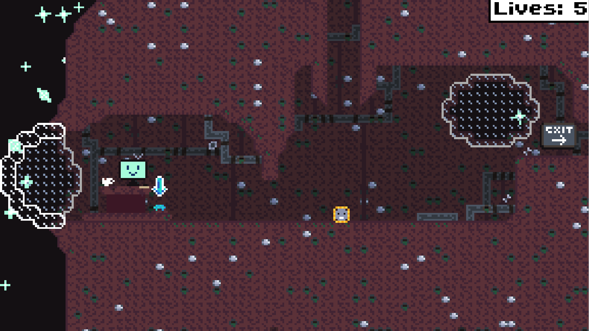

+++
title = "Space Gravity Game"
description = "A short game about a small robot and its efforts to repair a derelict space ship."
weight = 2
+++

# Space Gravity Game
This is a simple 2D platformer game I originally made as part of a college assignment. It is written in Python, uses Pygame for graphics, and Pymunk for physics.

The game currently contains a small selection of levels for you to play through, and one NPC (The Autopilot) for you to meet.

## Story
You play as a small maintenance robot on a derelict spaceship. As a maintenance robot, it is your duty to keep the ship moving and on track towards its eventual destination.

---

You can find this game's source code [here](https://github.com/OllieSHunt/space-gravity-game).
