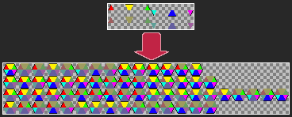

+++
title = "Hex Maker"
description = "Allows you to build full 64 hexagon tile spritesheets out of as little as 12 images."
weight = 5
+++

# Hex Maker
Hex Maker is a tool for building spritesheets for hexagonal tile maps.

I made this because I wanted to make a game using a hexagonal tile map using Godot. I was planning on using the [terrains](https://docs.godotengine.org/en/stable/tutorials/2d/using_tilemaps.html#handling-tile-connections-automatically-using-terrains) feature to automate placing tile variants based on the surrounding tiles. However, I did not want to spend the time to make the many different 64 tile spritesheets required for all my different tile types.

This project helps to solve that by allowing you to make just two sprites for each edge (an inside and edge variant) and allowing the code to do the rest!

---

The source code for the project can be found on my GitHub account, [here](https://github.com/OllieSHunt/hex-maker).
